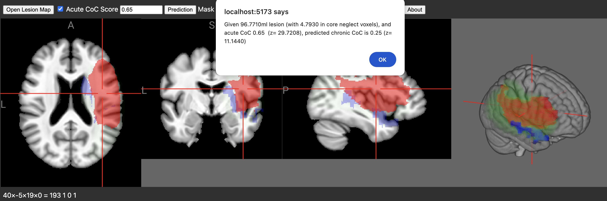
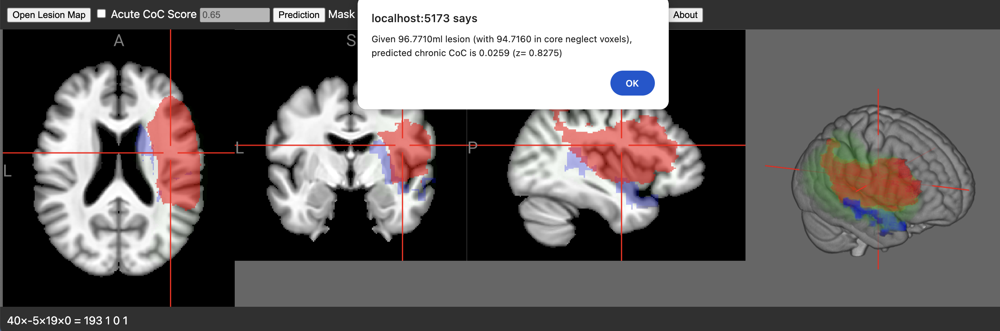

### NiiVue brainchop

Provided a lesion map and an acute [Center of Cancellation (CoC)](https://github.com/neurolabusc/Cancel) score, this web page will predict the chronic neglect severity. The provided lesion map should be normalized to standard space. This is an edge-based solution: the values are computed directly on the web browser, and are not shared with a cloud service. [Try the live demo](https://niivue.github.io/niivue-neglect/)

### Optimal Usage

One can create an accurate prediction of long term spatial neglect symptom severity by providing a lesion map showing the location and extent of the injury as well as the acute behavior (the CoC score).

 1. Open the [live demo](https://niivue.github.io/niivue-neglect/).
 2. Press the `Open Lesion Map` button and select the normalized lesion. You can normalize lesions using [the clinical toolbox for SPM](https://github.com/neurolabusc/Clinical).
 3. You can visually inspect the lesion (shown as red) with respect to the grayscale atlas and the core prediction voxels (shown in blue).
 4. Make sure the `Acute CoC Score` option is `checked`. 
 5. Set the [Center of Cancellation (CoC)](https://github.com/neurolabusc/Cancel) score that was measured acutely.
 6. Press the `Prediction` button to see the expected outcome score.



### Basic Usage

One can create an rough prediction of long term spatial neglect symptom severity by providing a lesion map showing the location and extent of the injury. Note this method is less accurate than methods where acute behavior is known.

 1. Open the [live demo](https://niivue.github.io/niivue-neglect/).
 2. Press the `Open Lesion Map` button and select the normalized lesion. You can normalize lesions using [the clinical toolbox for SPM](https://github.com/neurolabusc/Clinical).
 3. You can visually inspect the lesion (shown as red) with respect to the grayscale atlas and the extended prediction voxels (shown in translucent green).
 4. Make sure the `Acute CoC Score` option is `unchecked`. Notice that the ability to set the symptom severity will be disabled.
 6. Press the `Prediction` button to see the expected outcome score.




### For Developers

You can serve a hot-reloadable web page that allows you to interactively modify the source code.

```bash
git clone https://github.com/niivue/niivue-neglect
cd niivue-neglect
npm install
npm run dev
```

### Links

These models are described by Röhrig et al.:

 - Röhrig L, Wiesen D, Li D, Karnath H-O ([2024](https://www.medrxiv.org/content/10.1101/2024.01.10.24301050v1)). Predicting individual long-term prognosis of spatial neglect based on acute stroke patient data. medRxiv 2024.01.10.24301050, https://doi.org/10.1101/2024.01.10.24301050
