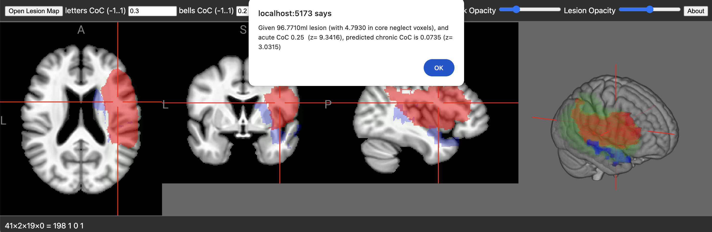

### NiiVue brainchop

Provided a lesion map and an acute [Center of Cancellation](https://github.com/neurolabusc/Cancel) score, this web page will predict the chronic neglect severity. The provided lesion map should be normalized to standard space. This is an edge-based solution: the values are computed directly on the web browser, and are not shared with a cloud service. [Try the live demo](https://niivue.github.io/niivue-neglect/)

### Usage

 1. Open the [live demo](https://niivue.github.io/niivue-neglect/).
 2. Press the `Open Lesion Map` button and select the normalized lesion. You can normalize lesions using [the clinical toolbox for SPM](https://github.com/neurolabusc/Clinical).
 3. You can visually inspect the lesion (shown as red) with respect to the grayscale atlas and the core prediction voxels (shown in blue).
 4. Set the [Center of Cancellation (CoC)](https://github.com/neurolabusc/Cancel) score that was measured acutely.
 5. Press the `Prediction` button to see the expected outcome score.



### For Developers

You can serve a hot-reloadable web page that allows you to interactively modify the source code.

```bash
git clone https://github.com/niivue/niivue-neglect
cd niivue-neglect
npm install
npm run dev
```
